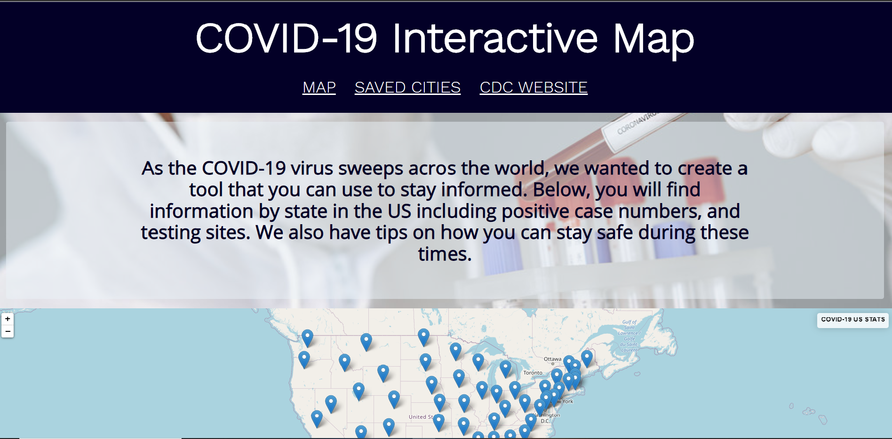

**
# COVID-19 Interactive Map
[Deployment](https://hannahbrijenkins.github.io/COVID19-Interactive-Map/)

In today's world, there is often an array if misleading information being spread via news headlines and social media. This includes the devastating Corona virus that has slowed down the entire world.
This web application is an interactive map that allows users to see COVID-19 statistics in the USA including the number of positive among other information. This straight-forward application also provides a carousel of tips and advice on staying safe from the virus, and how to protect others.

## How to Use

To use this web app, simply click on the marked state of the information you would like to see. Zoom in or out of the map to see more or less areas. You may save up to 5 states to view later on your browser. Click the button labeled "Save State" to save the state you have selected. To review the information on a state you have saved, go to the "Saved States" section and click on the state that you want to revisit.
 
## CSS Framework

[Pure.css](https://purecss.io/) framework was used for this project for the grids, buttons, and menus.

## Deployment

You can view the deployed application [here](https://hannahbrijenkins.github.io/COVID19-Interactive-Map/).

## API's Used

 - [The Covid Tracking Project](https://covidtracking.com/data/api)
 - [Leaflet JS](https://leafletjs.com/)

## Authors

**Stephon Smith**  - [SmithBWare89](https://github.com/SmithBWare89)
**Hannah Jenkins** - [hannahbrijenkins](https://github.com/hannahbrijenkins)
**Jesus Molina**  - [Kos-MovV4](https://github.com/Kos-MosV4)

